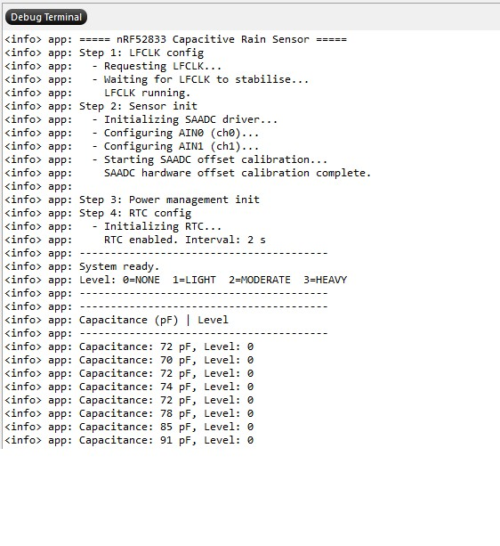

# 🌧️ nRF52833 — Low-Cost Capacitive Rain Sensor Using MCU Built-in ADC


This repository contains the firmware and supporting material for a low-cost, low-power capacitive rain sensor designed for agricultural IoT applications. Capacitance is measured directly using the built-in 12-bit SAADC of the nRF52833 — **no external CDC or CFC chip required**.

> 📄 **Student Report:** [A Low-Cost Capacitive Rain Sensor for Agriculture Using Only MCU Built-in ADC](Report/SONG%20Humeizi.pdf)  
> 👩‍🎓 **Student:** Humeizi Song — shmz2025@126.com  
> 🎓 **Degree:** BEng in Electrical and Electronic Engineering, Heriot-Watt University, Edinburgh  
> 👨‍🏫 **Supervisor:** Dr. Spyridon Daskalakis  
> 📅 **Submission date:** 13 April 2026

---

## 💡 Concept and Measurement Principle

The measurement principle is adapted from the **Arduino small-capacitance method**:

> 🔗 Reference: [Cap Meter with Arduino Uno — codewrite.co.uk](https://wordpress.codewrite.co.uk/pic/2014/01/21/cap-meter-with-arduino-uno/index.html)

When rain falls on a PCB interdigital electrode, the effective dielectric constant of the electrode area changes, causing a measurable rise in capacitance (ΔC). This change is detected by the nRF52833 using only **two GPIO pins** and its internal SAADC — no external analogue front-end is needed.

### ⚙️ Measurement Cycle

An unknown capacitor **C_x** (the rain sensor electrode) is connected between:

| Signal   | nRF52833 Pin | Role                                      |
|----------|--------------|-------------------------------------------|
| OUT\_PIN | P0.02 (AIN0) | Driven high to charge C_x                |
| IN\_PIN  | P0.03 (AIN1) | Voltage read by SAADC after charge delay  |

The internal pull-up resistor (≈ 13 kΩ) provides the charging path. No external resistors or capacitors are required.

Each measurement cycle:

1. **🔻 Discharge phase** — both pins driven low, fully discharging C_x (5 ms + 1 ms settling)
2. **🔺 Charge phase** — OUT\_PIN set high; pull-up resistor charges C_x exponentially: `V(t) = Vref × (1 − e^(−t/RC))`
3. **📡 ADC sampling** — after a fixed 1 ms charge delay, IN\_PIN voltage is sampled via SAADC
4. **🧮 Capacitance calculation** — ADC reading `val` (0–4095) is converted using the calibrated formula:

```
C = val × K / (4095 − val) − C_stray
```

where `K` is a proportionality factor and `C_stray` is system stray capacitance, both determined by two-point calibration.

---

## ✅ Features

* ⏱️ RTC-triggered periodic sampling every 2 seconds (ultra low power)
* 🚫 No external conversion chips — only MCU GPIO and built-in SAADC
* 🔬 12-bit resolution SAADC in single-ended mode
* **Enhancement 1 — Oversampling:** 10 ADC readings averaged per discharge-charge cycle (reduces noise by ~√10)
* **Enhancement 2 — Outlier rejection:** 15 repeated measurements per sample; sorted, trimmed (3 from each end), then averaged
* **Enhancement 3 — Moving average filter:** 5-point circular moving average applied to consecutive capacitance values
* **Enhancement 4 — Extended charge/discharge timing:** 1 ms charge delay; 5 ms discharge + 1 ms settling for full capacitor reset
* **Enhancement 5 — Two-point calibration mode:** uses 10 pF and 100 pF reference capacitors to compute K and C_stray
* **Enhancement 6 — Power optimisation:** RTC wakes MCU every 2 s; CPU sleeps between measurements via `nrf_pwr_mgmt_run()`
* 🌧️ Rain intensity classification: **None / Light / Moderate / Heavy** output via SEGGER RTT log
* 💡 LED indicators for sampling and calibration events

---

## 📊 Performance Results



| Metric                       | Value                              |
|------------------------------|------------------------------------|
| 📏 Measurement range         | 10 pF – 500 pF                     |
| 🎯 Static accuracy (error)   | < 10 %                             |
| 🔁 Repeatability             | < 5 %                              |
| ⚡ Response time             | 2 seconds                          |
| 🔋 Average power consumption | ≈ 0.08 mW (≈ 27 µA at 3 V)        |
| 😴 Idle sleep current        | ≈ 2 µA (RTC running)               |
| ⚡ Active measurement current | ≈ 5 mA for ≈ 10 ms per cycle      |
| 💰 Cost saving vs CDC scheme | ≈ £5 per node (50 % reduction)     |

---

## 🔧 Hardware Requirements

* [nRF52833 Development Kit (pca10100)](https://www.nordicsemi.com/Products/Development-hardware/nRF52833-DK)
* PCB interdigital electrode (capacitive rain sensor)
* No external resistors or capacitors required
* Optional: 10 pF and 100 pF reference capacitors for two-point calibration
* Optional: LEDs for visual indicators

### 📌 Pin Assignment

| Signal   | nRF52833 Pin | Description                        |
|----------|--------------|------------------------------------|
| OUT\_PIN | P0.02 (AIN0) | Charging output pin                |
| IN\_PIN  | P0.03 (AIN1) | ADC sense input pin                |

The internal pull-up resistor (R\_PULLUP ≈ 13 kΩ) on IN\_PIN is the only charging element.

---

## 🛠️ Software Details

* **SDK Version:** nRF5 SDK 17.1.0
* **SoftDevice:** Not required
* **Toolchain:** SEGGER Embedded Studio or GCC  
  ➤ Tested with **SEGGER Embedded Studio for ARM v5.42a**

> 📁 **To run this project:**
> 1. Place the entire folder under: `nRF5_SDK_17.1.0_ddde560\examples\peripheral\`
> 2. Open the project file `saadc_pca10100.emProject` located in: `pca10100\blank\ses\`
> 3. Both `main.c` and `rain_sensor.c` are already registered in the project — no manual steps needed.

---

## ⚙️ Configuration

Key parameters split across [main.c](main.c) and [rain_sensor.h](rain_sensor.h):

| Macro | File | Default | Description |
|-------|------|---------|-------------|
| `RAIN_MEASUREMENT_INTERVAL_SEC` | `main.c` | `2` | RTC period between measurements (seconds) |
| `LED_FUNCTIONALITY_ENABLED` | `main.c` | `1` | Toggle LED on each measurement |
| `CALIBRATION_FUNCTIONALITY_ENABLED` | `rain_sensor.h` | `0` | Set to `1` to run two-point calibration |
| `USE_LEVEL_STRING` | `rain_sensor.h` | `0` | `0` = numeric level, `1` = text string |
| `IN_STRAY_CAP_TO_GND` | `rain_sensor.c` | `99.0` | Proportionality factor K (from calibration) |
| `C_STRAY` | `rain_sensor.c` | `41.0` | System stray capacitance in pF (from calibration) |
| `ADC_OVERSAMPLE` | `rain_sensor.c` | `10` | ADC reads averaged per charge cycle |
| `CHARGE_DELAY_US` | `rain_sensor.c` | `1000` | Capacitor charge time (us) |
| `MEASURE_REPEAT` | `rain_sensor.c` | `15` | Charge cycles per measurement (outlier rejection) |

---

## 🔄 Algorithm Overview

```
🚀 System Init (GPIO, SAADC, RTC)
        │
        ▼
🔧 [Optional] Two-Point Calibration Mode
        │  Measure 10 pF  → compute ADC average
        │  Measure 100 pF → compute ADC average
        │  Solve for K and C_stray
        ▼
⏱️  Measurement Mode  (RTC triggers every 2 s)
        │
        ▼
📡 Capacitance Measurement
        │  Discharge (5 ms) → Charge (1 ms) → ADC sample
        │  Repeat 15 times with 10× oversampling each
        │  Sort → trim 3 from each end → average  (outlier rejection)
        ▼
📉 Moving Average Filter  (5-point circular buffer)
        │
        ▼
🌧️  Rain Intensity Classification
        │  None / Light / Moderate / Heavy
        ▼
📋 NRF_LOG output  →  😴 Sleep until next RTC tick
```

---

## 📂 Repository Structure

```
.
├── main.c                  # System init and main loop (clock, RTC, power management)
├── rain_sensor.c           # Sensor logic (SAADC, measurement, filtering, calibration)
├── rain_sensor.h           # Public sensor API and configuration macros
├── Images/
│   └── board 1.jpeg        # Hardware photo
├── Report/
│   └── SONG Humeizi.pdf    # Full Honours report
├── pca10100/
│   └── blank/ses/          # SEGGER Embedded Studio project files
└── plots/                  # Power profiler measurement plots
```

---

## 📝 License

This project uses Nordic Semiconductor's standard SDK license.

---

## 👥 Author / Supervisor

| Role         | Name                    | Contact                    |
|--------------|-------------------------|----------------------------|
| 👩‍🎓 Student    | Humeizi Song            | shmz2025@126.com           |
| 👨‍🏫 Supervisor | Dr. Spyridon Daskalakis | daskalakispiros@gmail.com  |

🏛️ School of Engineering and Physical Science, Heriot-Watt University, Edinburgh EH14 4AS, UK

---
